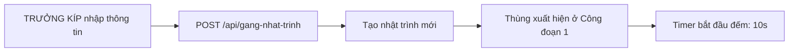
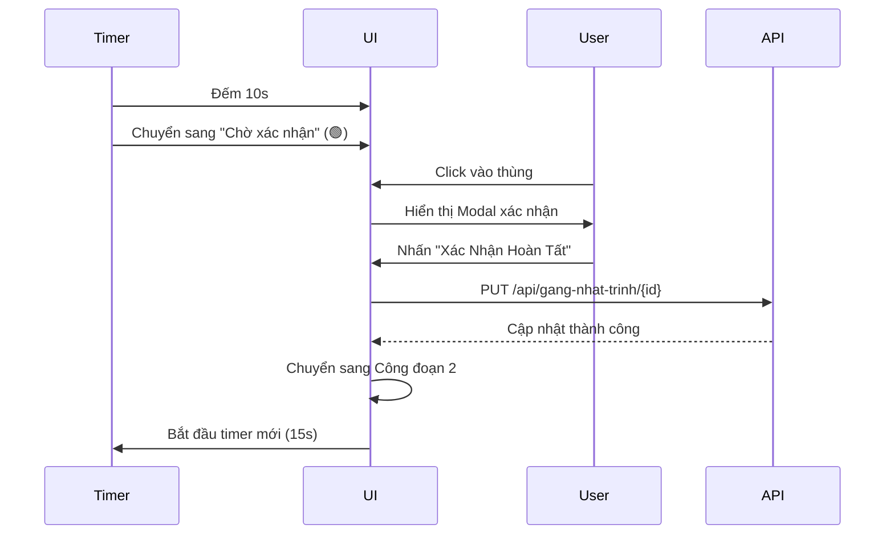
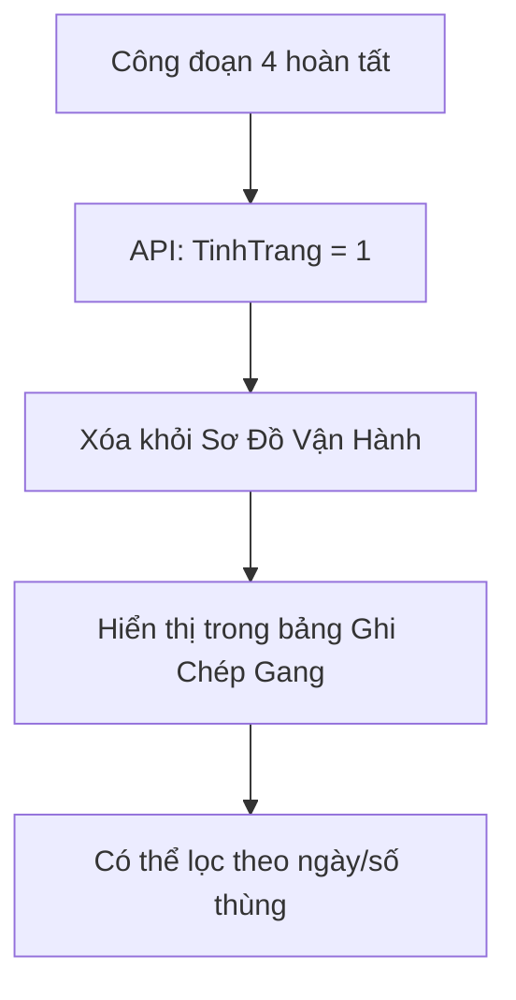

# 🏭 Hệ Thống Giám Sát Vận Chuyển Thùng Gang

> Hệ thống theo dõi và quản lý nhật trình vận chuyển thùng gang thời gian thực cho nhà máy luyện kim

---

## 📋 Mục Lục

- [Tổng Quan](#-tổng-quan)
- [Kiến Trúc Hệ Thống](#-kiến-trúc-hệ-thống)
- [Luồng Hoạt Động](#-luồng-hoạt-động)
- [Chi Tiết Công Đoạn](#-chi-tiết-công-đoạn)
- [Phân Quyền Người Dùng](#-phân-quyền-người-dùng)
- [API Endpoints](#-api-endpoints)
- [Hướng Dẫn Sử Dụng](#-hướng-dẫn-sử-dụng)
- [Trạng Thái Thùng Gang](#-trạng-thái-thùng-gang)
- [Cấu Trúc Dữ Liệu](#-cấu-trúc-dữ-liệu)

---

## 🎯 Tổng Quan

Hệ thống điều độ thùng gang là giải pháp quản lý vận chuyển thời gian thực, cho phép:

- ✅ **Theo dõi** vị trí và trạng thái thùng gang qua **6-7 công đoạn** (tùy loại hình)
- ✅ **Phân bổ** nhật trình vận chuyển từ Lò Cao 1-6 đến HRC1/HRC2/Đúc Gang
- ✅ **Xác nhận** hoàn tất các công đoạn với timeline đầy đủ
- ✅ **Ghi chép** lịch sử chi tiết với TPHH (Thành Phần Hóa Học)
- ✅ **Phân quyền** 3 cấp độ: VIEW, TRUONGKIP, DIEUDO + filter theo Lò Cao/HRC
- ✅ **Rollback** quay lại công đoạn trước khi xác nhận nhầm
- ✅ **Xem chi tiết** thông tin TPHH và hành trình thùng từ bảng lịch sử

---

## 🏗️ Kiến Trúc Hệ Thống

### Frontend

- **HTML5** + **CSS3** (Custom Design System)
- **Vanilla JavaScript** (ES6+)
- **Real-time Updates** (Auto-refresh 5s)

### Backend API

- Base URL: `https://chart.hoaphatdungquat.vn/api/gang-nhat-trinh`
- RESTful API với CRUD operations
- JSON data format

### Thiết Kế Giao Diện

```
┌────────────────────────────────────────────────────────────────────┐
│           🏭 Hệ Thống Vận Chuyển Thùng Gang              │
├────────────────────────────────────────────────────────────────────┤
│  [1] PHÂN BỔ VẬN CHUYỂN (Chỉ TRUONGKIP)                │
│      - Chọn Điểm đầu: Lò Cao 1-6                        │
│      - Chọn Điểm đến: HRC1, HRC2, Đúc Gang               │
├────────────────────────────────────────────────────────────────────┤
│  [2] SƠ ĐỒ VẬN HÀNH (6 cột - HRC có thêm 2 công đoạn KR)  │
│  ┌─────┐ ┌─────┐ [┌────┐ ┌────┐] ┌─────┐ ┌─────┐    │
│  │🚚 1│ │⏳ 2│ [│🚪3│ │🚶 4│] │🔥 5│ │✅ 6│    │
│  │ 10s│ │ 15s│ [│ KR │ │ KR │] │ 20s│ │ 12s│    │
│  └─────┘ └─────┘  └────┘ └────┘  └─────┘ └─────┘    │
│  * Công đoạn 3,4 chỉ hiển với HRC1/HRC2                   │
├────────────────────────────────────────────────────────────────────┤
│  [3] GHI CHÉP GANG (Có nút 🔍 Xem chi tiết)              │
│      - Bảng lịch sử với bộ lọc ngày/số thùng            │
│      - Hiển thị đầy đủ 7 mốc thời gian + TPHH           │
│      - Xem modal chi tiết: Timeline + TPHH đầy đủ          │
└────────────────────────────────────────────────────────────────────┘
```

---

## 🔄 Luồng Hoạt Động

### 1️⃣ Khởi Tạo Vận Chuyển



**Chi tiết:**

- Nhập: Số thùng (VD: 01), Điểm đầu (Lò Cao 1-4), Điểm đến (Đúc gang/HRC1/HRC2)
- API tạo bản ghi với `GioBatDau = now()`
- Thùng hiển thị với trạng thái **"Đang xử lý"** (🔴 dot đỏ nhấp nháy)

---

### 2️⃣ Xử Lý Công Đoạn



**Chu trình lặp lại cho 4 công đoạn:**

| Công Đoạn | Thời Gian | Hành Động              | API Payload                        |
| --------- | --------- | ---------------------- | ---------------------------------- |
| 1 → 2     | 10s       | Xác nhận vào gian chờ  | `{ GioVaoLT: now() }`              |
| 2 → 3     | 15s       | Xác nhận rót xong      | `{ GioRotXong: now() }`            |
| 3 → 4     | 20s       | Xác nhận ra luyện thép | `{ GioRaLT: now(), TinhTrang: 1 }` |
| 4 → ✅    | 12s       | Hoàn tất               | Xóa khỏi sơ đồ, lưu vào lịch sử    |

---

### 3️⃣ Hoàn Tất Và Ghi Chép



---

## 📊 Chi Tiết Công Đoạn

### Công Đoạn 1: Bắt Đầu Vận Chuyển

- **Icon:** 🚚
- **Thời gian:** 10 giây
- **Mô tả:** Thùng gang bắt đầu di chuyển từ Lò Cao
- **Mốc thời gian:** `GioBatDau`
- **Tính năng:**
  - Nút XÓA (❌) - chỉ được xóa ở công đoạn này
  - Nút ROLLBACK (↶) - quay lại công đoạn trước (từ stage 2+)
  - Nút EDIT (✏️) - chỉnh sửa điểm đầu/điểm đến
- **Logic đặc biệt:** Nếu điểm đến = "Đúc Gang" → Chuyển thẳng sang hoàn tất (bỏ qua stage 2-6)

### Công Đoạn 2: Vào Gian Chờ Thép

- **Icon:** ⏳
- **Thời gian:** 15 giây
- **Mô tả:** Thùng gang đã vào khu vực luyện thép, chờ rót
- **Mốc thời gian:** `GioVaoLT`
- **Tính năng HRC:** Nút "Xác Nhận Vào KR" (chỉ hiện với HRC1/HRC2)

### Công Đoạn 3: Vào KR (Chỉ HRC)

- **Icon:** 🚪
- **Thời gian:** 20 giây
- **Mô tả:** Thùng đi vào khu vực KR (chỉ dành cho HRC1/HRC2)
- **Mốc thời gian:** `GioVaoKR`
- **Hiển thị:** Chỉ hiển khi DiemDen = HRC1 hoặc HRC2

### Công Đoạn 4: Ra KR (Chỉ HRC)

- **Icon:** 🚶
- **Thời gian:** 15 giây
- **Mô tả:** Thùng ra khỏi KR, chuẩn bị rót gang
- **Mốc thời gian:** `GioRaKR`
- **Hiển thị:** Chỉ hiển khi DiemDen = HRC1 hoặc HRC2

### Công Đoạn 5: Rót Xong (Trả Vỏ)

- **Icon:** 🔥
- **Thời gian:** 20 giây
- **Mô tả:** Hoàn tất rót gang, chuẩn bị trả thùng rỗng
- **Mốc thời gian:** `GioRotXong`

### Công Đoạn 6: Hoàn Tất (Ra Luyện Thép / Đúc Gang)

- **Icon:** ✅
- **Thời gian:** 12 giây
- **Mô tả:** Thùng rời khỏi khu vực, kết thúc chu kỳ
- **Mốc thời gian:** `GioRaLT` (ra luyện thép) hoặc `GioDucGang` (đúc gang)
- **API payload:** `{ GioRaLT: now(), TinhTrang: 1 }` hoặc `{ GioDucGang: now(), TinhTrang: 1 }`
- **Chức năng:** Chọn chu kỳ tiếp theo (Lò Cao 1-6, Bảo Dưỡng, Đúc Gang)
- **Hiển thị:** Stage 6 và 7 cùng hiển thị ở vùng Hoàn Tất

---

## 🔐 Phân Quyền Người Dùng

### Hệ Thống Phân Quyền + Filter

| Mã Đăng Nhập          | Quyền Hạn     | Hiển Thị Công Đoạn         | Filter   | Mô Tả                                                                                         |
| --------------------- | ------------- | -------------------------- | -------- | --------------------------------------------------------------------------------------------- |
| `TRUONGKIP`           | 🟢🟢🟢 Full   | Tất cả (1-6, bao gồm KR)   | Không    | - Phân bổ vận chuyển mới<br>- Xác nhận công đoạn<br>- Xóa/Rollback/Edit<br>- Xem tất cả thùng |
| `VIEW`                | 🟡 Read-Only  | Tất cả (1-6, bao gồm KR)   | Không    | - Chỉ xem thông tin<br>- Click xem modal TPHH + timeline<br>- KHÔNG thao tác chức năng        |
| `LOCAO1` - `LOCAO6`   | 🟢🟢 Operator | 1, 2, 5, 6 (Ẩn KR)         | Lò Cao X | - Xác nhận công đoạn<br>- KHÔNG phân bổ mới<br>- Chỉ xem thùng từ Lò Cao X                    |
| `HRC1`, `HRC2`        | 🟢🟢 Operator | 2, 3, 4, 5 (Ẩn stage 1, 6) | HRC X    | - Xác nhận công đoạn<br>- KHÔNG phân bổ mới<br>- Chỉ xem thùng đến HRC X                      |
| `DIEUDO` (deprecated) | 🟢🟢 Operator | 1, 2, 5, 6                 | Không    | - Xác nhận công đoạn<br>- KHÔNG phân bổ mới                                                   |

### Cơ Chế Phân Quyền

```javascript
// 1. Khi vào trang lần đầu
if (!localStorage.getItem("GANG_ROLE")) {
  showLoginModal(); // Hiển thị modal đăng nhập
}

// 2. Sau khi nhập mã
if (code === "TRUONGKIP" || code === "DIEUDO") {
  setRole(code);
} else {
  setRole("VIEW"); // Mặc định chỉ xem
}

// 3. Áp dụng quyền
function applyRolePermission() {
  if (role === "TRUONGKIP") {
    // Hiện section Phân bổ vận chuyển
    // Cho phép xác nhận công đoạn
  } else if (role === "DIEUDO") {
    // Ẩn section Phân bổ vận chuyển
    // Cho phép xác nhận công đoạn
  } else {
    // Ẩn section Phân bổ vận chuyển
    // KHÔNG cho phép xác nhận công đoạn
  }
}
```

---

## 🌐 API Endpoints

### Base URL

```
https://chart.hoaphatdungquat.vn/api/gang-nhat-trinh
```

### 1. Tạo Nhật Trình Mới

**Endpoint:** `POST /api/gang-nhat-trinh`

**Request:**

```json
{
  "SoThung": "01",
  "NgayTao": "2026-01-13T08:00:00.000Z",
  "GioBatDau": "2026-01-13T08:00:00.000Z",
  "DiemDau": "Lò Cao 1",
  "DiemDen": "HRC1"
}
```

**Response:**

```json
{
  "ID": 123,
  "SoThung": "01",
  "NgayTao": "2026-01-13T08:00:00.000Z",
  "GioBatDau": "2026-01-13T08:00:00.000Z",
  "DiemDau": "Lò Cao 1",
  "DiemDen": "HRC1",
  "TinhTrang": 0
}
```

---

### 2. Cập Nhật Công Đoạn

**Endpoint:** `PUT /api/gang-nhat-trinh/{id}`

**Request (Công đoạn 1 → 2):**

```json
{
  "GioVaoLT": "2026-01-13T08:00:10.000Z"
}
```

**Request (Công đoạn 2 → 3):**

```json
{
  "GioRotXong": "2026-01-13T08:00:25.000Z"
}
```

**Request (Công đoạn 3 → 4 - Hoàn tất):**

```json
{
  "GioRaLT": "2026-01-13T08:00:45.000Z",
  "TinhTrang": 1
}
```

---

### 3. Tìm Kiếm Nhật Trình

**Endpoint:** `GET /api/gang-nhat-trinh/search`

**Query Parameters:**

- `fromDate` (optional): Ngày bắt đầu (YYYY-MM-DD)
- `toDate` (optional): Ngày kết thúc (YYYY-MM-DD)
- `soThung` (optional): Số thùng cần tìm

**Example:**

```
GET /api/gang-nhat-trinh/search?fromDate=2026-01-13&toDate=2026-01-13&soThung=01
```

**Response:**

```json
[
  {
    "ID": 123,
    "SoThung": "01",
    "NgayTao": "2026-01-13T08:00:00.000Z",
    "DiemDau": "Lò Cao 1",
    "DiemDen": "HRC1",
    "GioBatDau": "2026-01-13T08:00:00.000Z",
    "GioVaoLT": "2026-01-13T08:00:10.000Z",
    "GioRotXong": "2026-01-13T08:00:25.000Z",
    "GioRaLT": "2026-01-13T08:00:45.000Z",
    "TinhTrang": 1
  }
]
```

---

### 4. Lấy Dữ Liệu Mới Nhất Của Ca Hiện Tại

**Endpoint:** `GET /api/gang-nhat-trinh/latest`

**Mô tả:** Lấy dữ liệu của ngày ca sản xuất mới nhất (tự động detect NgaySX + CaSX)

**Response:** Danh sách thùng đang vận hành của ca hiện tại

**Client-side filtering:**

```javascript
// Filter theo lò cao
runningData = runningData.filter(
  (item) => item.DiemDau === `Lò Cao ${loCaoFilter}`,
);

// Filter theo HRC
runningData = runningData.filter((item) => item.DiemDen === `HRC${hrcFilter}`);
```

### 5. Lấy Thùng Hoàn Tất (Chưa Có Chu Kỳ Mới)

**Endpoint:** `GET /api/gang-nhat-trinh/completed-not-next`

**Response:** Danh sách thùng có `TinhTrang = 1` (hoàn tất)

---

## 📖 Hướng Dẫn Sử Dụng

### Cho TRƯỞNG KÍP

#### Bước 1: Đăng Nhập

1. Mở trang web
2. Nhập mã: `TRUONGKIP`
3. Nhấn **Xác nhận**

#### Bước 2: Phân Bổ Thùng Mới

1. Nhập **Số thùng** (VD: 01)
2. Chọn **Điểm đầu** (Lò Cao 1-4)
3. Chọn **Điểm đến** (Đúc gang/HRC1/HRC2)
4. Nhấn **Bắt Đầu Vận Chuyển**
5. Thùng xuất hiện ở công đoạn 1 với trạng thái "Đang xử lý"

#### Bước 3: Xác Nhận Công Đoạn

1. Chờ timer đếm hết (10s/15s/20s/12s)
2. Khi thùng hiển thị **"Chờ xác nhận"** (🟢 dot xanh)
3. **Click vào thùng** để mở modal xác nhận
4. Kiểm tra thông tin: Số thùng, điểm đầu/đến, thời gian công đoạn
5. Nhấn **✓ Xác Nhận Hoàn Tất**
6. Thùng tự động chuyển sang công đoạn tiếp theo

#### Bước 4: Xóa Thùng (Nếu Cần)

1. Chỉ có thể xóa thùng ở **Công đoạn 1**
2. Nhấn nút **❌** trên thùng
3. Xác nhận xóa trong modal

#### Bước 5: Xem Lịch Sử

1. Kéo xuống phần **Ghi Chép Gang**
2. Lọc theo:
   - **Từ ngày** → **Đến ngày**
   - **Số thùng** (nhập số cần tìm)
3. Nhấn **🔍 Lọc**
4. Xem chi tiết 4 mốc thời gian của mỗi thùng

---

### Cho ĐIỀU ĐỘ

#### Bước 1: Đăng Nhập

- Nhập mã: `DIEUDO`

#### Bước 2: Xác Nhận Công Đoạn

- **Không thể** phân bổ thùng mới
- **Có thể** xác nhận công đoạn (tương tự Trưởng kíp)
- **Có thể** xem lịch sử

---

### Cho NGƯỜI XEM

#### Bước 1: Đăng Nhập

- Nhập bất kỳ mã nào khác `TRUONGKIP` hoặc `DIEUDO`

#### Bước 2: Chỉ Xem

- Chỉ xem sơ đồ vận hành real-time
- Chỉ xem lịch sử
- **KHÔNG** thể thao tác gì

---

## 🚦 Trạng Thái Thùng Gang

### 1. 🔴 Đang Xử Lý (Processing)

- **Hiển thị:** Dot đỏ nhấp nháy ở góc icon
- **Ý nghĩa:** Thùng đang trong quá trình xử lý công đoạn
- **Timer:** Đếm ngược thời gian (VD: 00:10 → 00:00)
- **Thao tác:** KHÔNG thể xác nhận, phải đợi timer hết

```css
/* Visual */
- Border: Màu cyan
- Dot: Đỏ, pulse animation
- Background: Gradient theo công đoạn
```

---

### 2. 🟢 Chờ Xác Nhận (Waiting Confirm)

- **Hiển thị:** Dot xanh lá nhấp nháy
- **Ý nghĩa:** Công đoạn đã xử lý xong, chờ xác nhận
- **Badge:** "Chờ xác nhận" (màu xanh lá)
- **Thao tác:** Click để mở modal xác nhận

```css
/* Visual */
- Border: Cyan glowing
- Dot: Xanh lá, pulse animation
- Cursor: Pointer
- Hover: Translate X +3px
```

---

### 3. ✅ Hoàn Tất (Completed)

- **Hiển thị:** Icon xanh lá với glow effect
- **Ý nghĩa:** Đã hoàn tất công đoạn 4, chờ chu kỳ mới
- **Badge:** "Chờ chu kỳ mới"
- **Vị trí:** Vẫn ở công đoạn 4, opacity giảm

```css
/* Visual */
- Background: Linear gradient green
- Box-shadow: 0 0 12px rgba(0, 255, 136, 0.6)
- Opacity: 0.95
```

---

## 🗂️ Cấu Trúc Dữ Liệu

### Local State (transports array)

```javascript
{
  id: 123,                    // ID từ database
  soThung: "01",              // Số thùng
  diemDau: "Lò Cao 1",        // Điểm xuất phát
  diemDen: "HRC1",            // Điểm đích
  currentStage: 2,            // Công đoạn hiện tại (1-6)
  stageStartTime: Date,       // Thời điểm bắt đầu công đoạn
  stageStatus: "processing",  // processing | waiting-confirm | completed
  stageTimes: {
    stage1: Date,             // Mốc GioBatDau
    stage2: Date | null,      // Mốc GioVaoLT
    stage3: Date | null,      // Mốc GioVaoKR (HRC only)
    stage4: Date | null,      // Mốc GioRaKR (HRC only)
    stage5: Date | null,      // Mốc GioRotXong
    stage6: Date | null,      // Mốc GioRaLT
    stage7: Date | null       // Mốc GioDucGang
  },
  tphh: {                     // Thành Phần Hóa Học
    me: "Mẻ 01",            // Mẻ gang
    khoiLuong: 25.5,          // Khối lượng (tấn)
    nhietDoThung: 1450,       // Nhiệt độ (°C)
    c: "4.2",                 // Carbon (%)
    si: "0.8",                // Silicon (%)
    mn: "0.5",                // Manganese (%)
    p: "0.1",                 // Phosphorus (%)
    s: "0.05"                 // Sulfur (%)
  }
}
```

---

### Database Schema

| Field        | Type     | Mô Tả                          |
| ------------ | -------- | ------------------------------ |
| ID           | INT      | Primary key, auto-increment    |
| SoThung      | VARCHAR  | Số thùng gang                  |
| NgaySX       | DATE     | Ngày sản xuất                  |
| CaSX         | VARCHAR  | Ca sản xuất                    |
| ThuTu        | INT      | Thứ tự thùng                   |
| DiemDau      | VARCHAR  | Điểm xuất phát (Lò Cao 1-6)    |
| DiemDen      | VARCHAR  | Điểm đích (HRC1/HRC2/Đúc Gang) |
| GioBatDau    | DATETIME | Công đoạn 1                    |
| GioVaoLT     | DATETIME | Công đoạn 2                    |
| GioVaoKR     | DATETIME | Công đoạn 3 (HRC only)         |
| GioRaKR      | DATETIME | Công đoạn 4 (HRC only)         |
| GioRotXong   | DATETIME | Công đoạn 5                    |
| GioRaLT      | DATETIME | Công đoạn 6                    |
| GioDucGang   | DATETIME | Công đoạn 7 (đúc gang)         |
| TinhTrang    | INT      | 0 = Đang chạy, 1 = Hoàn tất    |
| Me           | VARCHAR  | Mẻ gang                        |
| KhoiLuong    | DECIMAL  | Khối lượng (tấn)               |
| NhietDoThung | INT      | Nhiệt độ thùng (°C)            |
| C            | DECIMAL  | Carbon (%)                     |
| Si           | DECIMAL  | Silicon (%)                    |
| Mn           | DECIMAL  | Manganese (%)                  |
| P            | DECIMAL  | Phosphorus (%)                 |
| S            | DECIMAL  | Sulfur (%)                     |

---

## 🔧 Tính Năng Kỹ Thuật

### Auto-Refresh

- **Tần suất:** 5 giây/lần
- **API:** GET `/search` + `/completed-not-next`
- **Logic:** Chỉ refresh khi KHÔNG có modal đang mở

```javascript
setInterval(() => {
  if (!isModalOpen) {
    loadDangVanHanhFromApi();
  }
}, 5000);
```

---

### Timer Real-time

- **Update:** Mỗi giây
- **Hiển thị:** MM:SS (VD: 02:35)
- **Tính toán:** `elapsed = (now - stageStartTime) / 1000`

```javascript
setInterval(() => {
  if (transports.length > 0) {
    updateDisplay(); // Re-render timer
  }
}, 1000);
```

---

### Modal Confirmation

- **Trigger:** Click vào thùng "Chờ xác nhận"
- **Hiển thị:**
  - Số thùng, điểm đầu/đến
  - Thời gian tại công đoạn hiện tại
  - Công đoạn tiếp theo
- **Actions:**
  - ✕ Hủy → đóng modal
  - ✓ Xác nhận → gọi API PUT, cập nhật state, chuyển công đoạn

---

## ⚠️ Lưu Ý Quan Trọng

### 1. Quy Tắc Xóa Thùng

- ✅ Chỉ được xóa thùng ở **Công đoạn 1**
- ❌ Không thể xóa thùng ở công đoạn 2, 3, 4
- Lý do: Tránh mất dữ liệu khi đã bắt đầu vận chuyển

### 2. Phân Quyền Chặt Chẽ

- Kiểm tra quyền ở **Frontend** (UI hiding)
- Nên kiểm tra quyền ở **Backend** (API validation)
- LocalStorage có thể bị chỉnh sửa → không nên dùng làm bảo mật chính

### 3. Đồng Bộ Dữ Liệu

- Auto-refresh 5s → có thể bị lag nếu nhiều người dùng
- Timer chỉ chính xác khi người dùng không rời trang
- Nên reload trang nếu nghi ngờ dữ liệu không đồng bộ

### 4. Xử Lý Lỗi

- Nếu API lỗi → hiển thị alert cho người dùng
- Không tự động retry → người dùng phải thao tác lại
- Kiểm tra kết nối mạng trước khi thao tác

---

## 📞 Hỗ Trợ

### Vấn Đề Thường Gặp

**Q: Tại sao tôi không thấy section "Phân Bổ Vận Chuyển"?**  
A: Bạn đang dùng tài khoản ĐIỀU ĐỘ hoặc VIEW. Chỉ TRƯỞNG KÍP mới thấy section này.

**Q: Tại sao không thể xác nhận công đoạn?**  
A: Kiểm tra:

- Timer đã hết chưa? (phải chuyển sang "Chờ xác nhận")
- Bạn có quyền xác nhận? (TRƯỞNG KÍP hoặc ĐIỀU ĐỘ)

**Q: Làm sao xóa thùng đã ở công đoạn 2?**  
A: KHÔNG THỂ. Chỉ xóa được thùng ở công đoạn 1.

**Q: Timer không đếm đúng?**  
A: Reload trang để đồng bộ lại dữ liệu từ server.

---

## 🚀 Cải Tiến Tương Lai

- [ ] WebSocket real-time thay vì auto-refresh
- [ ] Export Excel báo cáo lịch sử
- [ ] Dashboard thống kê (số lượng thùng/ngày, thời gian trung bình)
- [ ] Notification khi thùng chờ xác nhận
- [ ] Responsive tốt hơn cho mobile/tablet
- [ ] Dark/Light theme toggle
- [ ] Backend authentication thay vì localStorage

---

## 📄 License

© 2026 Hòa Phát Dung Quất. All rights reserved.
